# Violent crimes occur more frequently in city centers and during evening hours in San Francisco and Seattle

Both San Francisco and Seattle are cities which are rapidly being gentrified causing a change in the social and economic structures of the cities. Therefore, it is likely that crime is also driven by these mechanisms with a clear distinction of which crimes occur in which parts of these cities and during what times of the day. Areas already gentrified are more likely to be affected by property crimes than violent ones.


##Loading and preprocessing the data

Apart from loading both of the data files, it is necessary to preprocess some of the data to make both data sets easier to compare. Some of the information is dropped because it is redundant, not important for a comparative study, or missing in one of the datasets.


```r
sfo <- read.csv("sanfrancisco_incidents_summer_2014.csv", 
                colClasses = c("numeric","factor","factor","factor","factor",
                            "factor","factor","NULL","NULL","numeric","numeric",
                            "NULL","NULL"))
sea <- read.csv("seattle_incidents_summer_2014.csv",
                colClasses = c("numeric","NULL","NULL","NULL","factor","NULL",
                               "factor","NULL","factor","NULL","NULL","factor",
                               "NULL","NULL","numeric","numeric","NULL","NULL",
                               "NULL"))
#converting Dates into POSIX classes for plots
sea[,4] <- as.POSIXct(strptime(sea[,4], "%m/%d/%Y %I:%M:%S %p"))
sea$DayOfWeek <- weekdays(sea[,4])
sea <- sea[,c(1,3,2,8,4:7)]
sfo[,"Date"] = as.Date(sfo[,"Date"],format="%m/%d/%Y")
sfo[,"Date"] = as.POSIXct(paste(sfo$Date,sfo$Time))
sfo <- sfo[,c(1:5,7:9)]

#tidying up column names
labels = c("IncidntNum","Category","Description","DayOfWeek","Date_Time","District",
           "Longitude","Latidude")
colnames(sfo) <- labels
colnames(sea) <- labels
```

Furthermore, the different crime categories are adjusted to make comparisons easier. Categories that cannot easily be mapped from one dataset to the other will be ignored. Burglary is a wide ranging term assigned to several different categories of theft or trespassing used in the two different datasets. While the subcategories may be of importance when comparing the different types of theft, here we are more concerned with the level of violence associated with a crime. Thus, the distinction between burglary, robbery and assault is what we're most interested in.


```r
sfo$Category <- as.character(sfo$Category)
sfo[sfo$Category == "DRIVING UNDER THE INFLUENCE","Category"] <- "DUI"
sfo[sfo$Category == "WEAPON LAWS","Category"] <- "WEAPON"
sfo[sfo$Category == "LARCENY/THEFT","Category"] <- "BURGLARY"
sfo[sfo$Category == "TRESPASS","Category"] <- "BURGLARY"
sfo[sfo$Category == "STOLEN PROPERTY","Category"] <- "BURGLARY"
sea$Category <- as.character(sea$Category)
sea[sea$Category == "FORGERY","Category"] <- "FORGERY/COUNTERFEITING"
sea[sea$Category == "COUNTERFEIT","Category"] <- "FORGERY/COUNTERFEITING"
sea[sea$Category == "BURGLARY-SECURE PARKING-RES","Category"] <- "BURGLARY"
sea[sea$Category == "STOLEN PROPERTY","Category"] <- "BURGLARY"
sea[sea$Category == "BIKE THEFT","Category"] <- "BURGLARY"
sea[sea$Category == "SHOPLIFTING","Category"] <- "BURGLARY"
sea[sea$Category == "PICKPOCKET","Category"] <- "BURGLARY"
sea <- sea[!(sea$District == ""),]
sea <- sea[!(sea$District == "99"),]

catforcomp <- c("ASSAULT","BURGLARY","DISORDERLY CONDUCT","DUI",
                "FORGERY/COUNTERFEITING","PROSTITUTION","ROBBERY",
                "VEHICLE THEFT","WEAPON")
sea <- sea[sea$Category %in% catforcomp,]
sea$Category <- as.factor(sea$Category)
sfo <- sfo[sfo$Category %in% catforcomp,]
sfo$Category <- as.factor(sfo$Category)
sfo <- sfo[order(sfo$Category),]
sea <- sea[order(sea$Category),]
```

##Geographical plots

To obtain a general overview of where which types of crimes occur, here is an overview of all the crimes contained within the processed datasets for both San Francisco and Seattle.  

The basic overview of the geographic location of the occurence of the most common types of crimes commited shows that in both cities, Vehicle theft and burglary are widespread. More violent kind of crimes such as assault or robbery or weapon law offenses are more focused within the downtown areas. However, there are occurences of assault all over both cities albeit less concentrated in gentrified residential neighborhoods. Areas with barely any dots within the cities correspond to middle/upper class residential areas. Here, most crimes fall in the range of burglary or vehicle theft. Downtown areas or those areas still in the beginning stages of gentrification have much higher rates of weapon offenses or robberies than other residential neighborhoods. 

###San Francisco


```r
sfomap <- GetMap(center = "San Francisco", zoom=12)
colorarray <- c("magenta","black","cyan","green","brown","darkgrey","purple","orange","blue")
PlotOnStaticMap(sfomap,sfo$Latidude,sfo$Longitude,pch=20,cex=0.7, col=colorarray[sfo$Category])
legend("topright",legend = catforcomp, fill=colorarray[unique(sfo$Category)],cex=0.5)
```

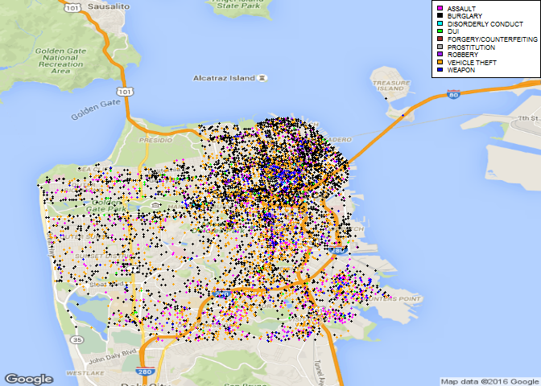


###Seattle


```r
seamap <- GetMap(center = "Seattle", zoom=11)
PlotOnStaticMap(seamap,sea$Latidude,sea$Longitude,pch=20,cex=0.7, 
                col=colorarray[sea$Category])
legend("topright",legend = catforcomp, fill=colorarray[unique(sea$Category)],
       cex=0.5)
```

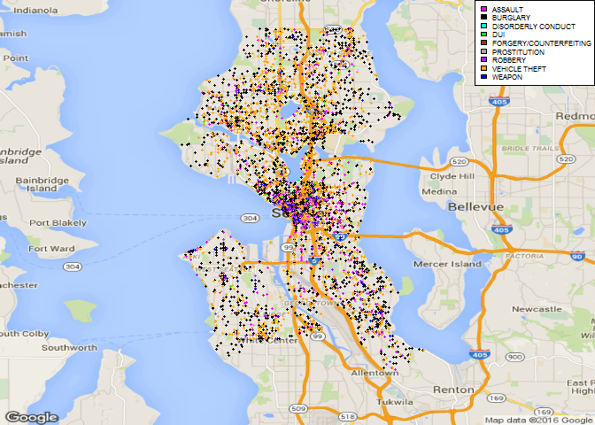


##Histograms of crime and district distribution
When considering the actual numbers of crimes committed within each district of the two cities, a similar picture emerges. 

###San Francisco
Gentrified residential neighborhoods of San Francisco such as Taravel, Park, Richmond or Ingleside have low overall crime rates mostly restricted to burglaries and vehicle theft. Downtown Areas and those still in the process of gentrification such as Central, Southern, Bayview or Mission have lower rates of burglary and higher rates of assault and weapon offenses. 


```r
color = grDevices::colors()[grep('gr(a|e)y', grDevices::colors(), 
                                 invert = TRUE)]
col2=sample(color,20)
PlotOnStaticMap(sfomap,sfo$Latidude,sfo$Longitude,pch=20,cex=2, 
                col=col2[sfo$District])
legend("topright",legend = unique(sfo$District), fill=col2[unique(sfo$District)],
       cex=0.5)
```

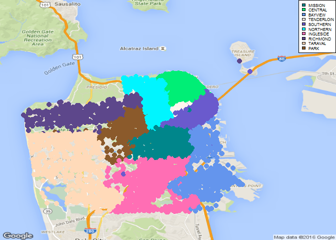


```r
g <- ggplot(data=sfo, aes(Category)) + stat_count() + 
    facet_wrap(~District, nrow = 2) + coord_flip()
print(g)
```

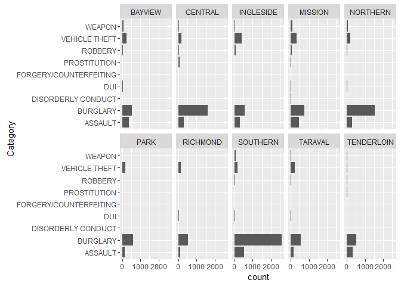


###Seattle
The same holds true for Seattle even if it's a little less obvious due to the large number of districts. Residential areas such as districts B, L or N-W have higher rates of burglaries and vehicle theft, but lower rates of assault or robberies (with the exception of S for the later which is an area in the Southeast of Seattle still in the process of gentrification). The downtown areas such as K, M or E on the other hand have significantly higher rates of assault or robberies.


```r
PlotOnStaticMap(seamap,sea$Latidude,sea$Longitude,pch=20,cex=2, 
                col=col2[sea$District])
legend("topright",legend = unique(sea$District), fill=col2[unique(sea$District)],
       cex=0.5)
```

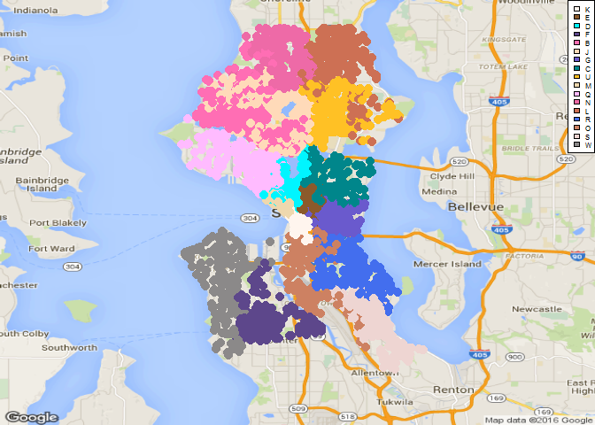


```r
sea <- sea[!(sea$District == "99"),]
g <- ggplot(data=sea, aes(Category)) + stat_count() + 
    facet_wrap(~District, nrow = 3) + coord_flip()
print(g)
```

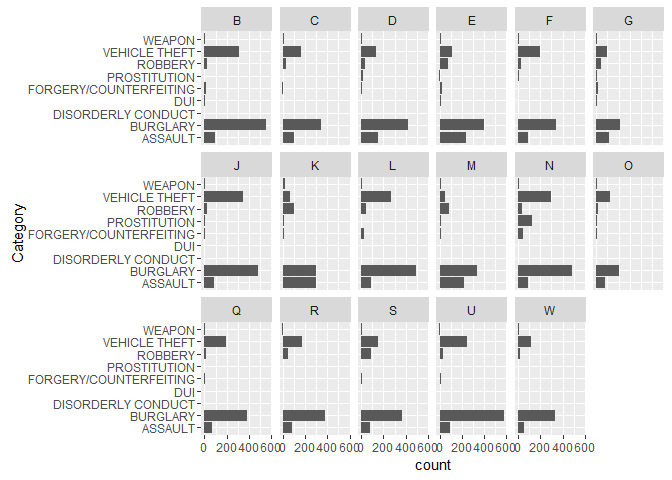


##Timeline plots

As a further study, the time of day when the different types of crimes occur might be of interest.

###Daily variation of total crimes in San Francisco


```r
omitcrimes <- c("DUI","DISORDERLY CONDUCT","WEAPON","FORGERY/COUNTERFEITING",
                "ROBBERY")
sfo <- sfo[!(sfo$Category %in% omitcrimes),]
sea <- sea[!(sea$Category %in% omitcrimes),]
sfo$Hour <- sapply(sfo$Date_Time,hour)
sea$Hour <- sapply(sea$Date_Time,hour)

hrlysfo <- tally(group_by(sfo,Hour,DayOfWeek))
hrlysea <- tally(group_by(sea,Hour,DayOfWeek))

g <- ggplot(data=hrlysfo, aes(Hour,n)) + geom_line() + 
    facet_wrap(~DayOfWeek,nrow = 2) + ylab("Total number of crimes")
g
```

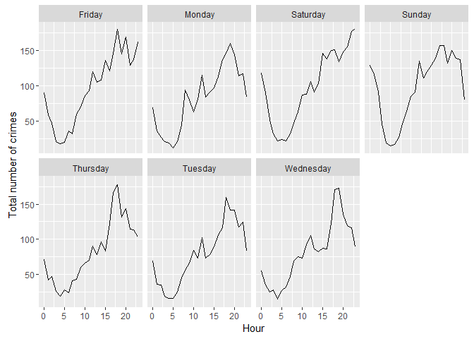

The total number of crimes per day plotted against the hour of the day show a similar pattern for all weekdays except Friday. From a low in the early morning hours around 5am, the number of crimes rise almost steadily with a large increase in the later afternoon hours leading to a maximum around 7pm and then they fall rapidly after 8pm. On Fridays and Saturdays, crime rates during the day are similar to the other weekdays, but they keep on rising well after 8pm. This is probably indicative of a more active nightlife on those two evenings leading to higher crime rates. On Sundays, crime rates are mostly constant throughout the day from around 11am to 9pm and low at all other times.


###Daily variation of total crimes in Seattle


```r
g <- ggplot(data=hrlysea, aes(Hour,n)) + geom_line() + 
    facet_wrap(~DayOfWeek,nrow = 2) + ylab("Total number of crimes")
g
```

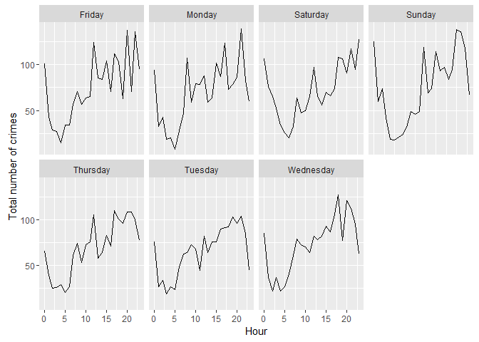

There is much less variation in the number of crimes between the different weekdays in Seattle. All days have lower crime rates in the early morning hours with the minimum around 5am which is the same as San Francisco. However, there isn't a clear peak of crime in the late afternoon/early evening hours such as the one of San Francisco. Instead, crime tends to occur throughout the day with smaller peaks around noon, mid afternoon and early evening. Rates seem to start falling around 9pm on all days except Saturdays and Tuesdays and Thursdays appear to have a bit less crime than the other days of the week.


###Hourly variation of crime categories in San Francisco

There is a very strong peak in the number of burglaries around 6pm which is probably responsible for the same peak in the total number of crimes given that burglaries make up a big chunk of that number. Vehicle thefts also peak within the late afternoon/early evening hours, but not as clearly defined and assaults seem to occur almost uniformly except for the early morning hours between 3-8am. While a more detailed study would be required to figure out which kind of burglaries are included within the numbers, it might also be the case that the early evening hours around 6pm is not necessarily the hour the crime occured, but possibly the hour when the crime was detected e.g. by homeowners returning from work.The same could hold true for vehicle thefts. Assaults on the other hand are usually noticed as soon as they occur.


```r
hrlycatsfo <- tally(group_by(sfo,Hour,Category))
hrlycatsea <- tally(group_by(sea,Hour,Category))

g <- ggplot(data=hrlycatsfo, aes(Hour,n)) + geom_line() + 
    facet_grid(~Category) + ylab("Number of crimes")
g
```

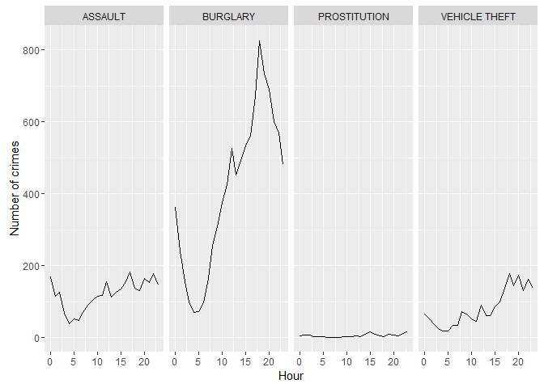


###Hourly variation of crime categories in Seattle

The numbers in Seattle show a similar pattern for vehicle theft as in San Francisco. It is also evident that prostitution is a crime of early evening hours in Seattle. The assault rate are also similar to the ones of San Francisco, but exhibit a more defined peak in the evening hours. Burglaries one the other hand are reported throughout the day with a peak around noon and a secondary one around 6pm. In order to explain the differences of the burglary rates between Seattle and San Francisco, more detailed studies on the type of burglaries would be required.


```r
g <- ggplot(data=hrlycatsea, aes(Hour,n)) + geom_line() + 
    facet_grid(~Category) + ylab("Number of crimes")
g
```

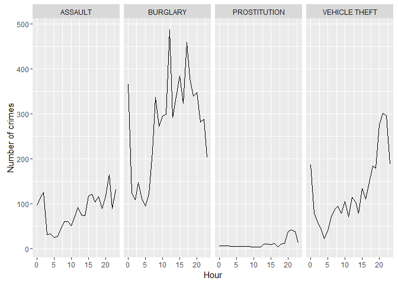


###Daily variation of crime categories in San Francisco

Based on daily variation of crime in San Francisco, it appears that prostitution is a Friday night crime whereas assaults generally rise toward the evening hours. Burglaries either occur or are reported most frequently in the early evening hours on weekdays and more uniformly spread across the late morning/afternoon and early evening of Saturday and Sunday.


```r
hrlycatdaysfo <- tally(group_by(sfo,Hour,Category, DayOfWeek))
hrlycatdaysea <- tally(group_by(sea,Hour,Category, DayOfWeek))

g <- ggplot(data=hrlycatdaysfo, aes(Hour,n)) + geom_line(aes(color=Category)) +
    facet_wrap(~DayOfWeek,nrow = 2) + ylab("Number of crimes")
g
```

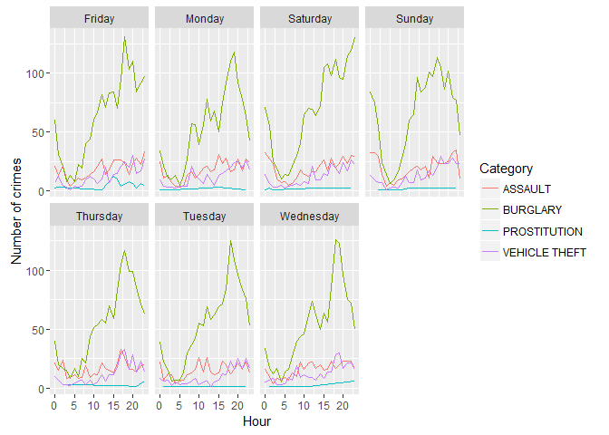


###Daily variation of crime categories in Seattle

Looking at the daily variation of crime categories in Seattle shows that the noon peak of burglaries isn't evenly distributed among the days of the week. It is very obvious on Sunday which might indicate detection of a burglary upon returning from a Sunday morning excursion?
Assault rates are much higher in the early morning hours of both Saturday and Sunday than any other day which hint to a connection to a more active nightlife in those nights/early mornings.


```r
g <- ggplot(data=hrlycatdaysea, aes(Hour,n)) + geom_line(aes(color=Category)) + 
    facet_wrap(~DayOfWeek,nrow = 2) + ylab("Number of crimes")
g
```

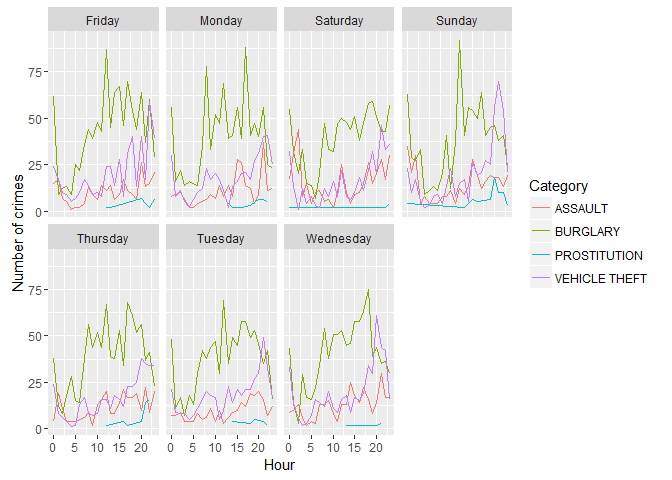


##Conclusion

The data shows quite clearly that violent crimes (i.e. assaults or robberies) occur much more frequently in city centers or areas still in the process of gentrification than other residential neighborhoods. In Seattle, there is also a clear peak of assault crime in the evening hours and especially Friday and Saturday nights. San Francisco has a similar peak in violent crime during those weekend nights, but it is not as clearly defined as in Seattle. When ignoring the day of the week, the number of assaults in San Francisco only fluctuates without a strong peak during the hours of around 8am to 2am. The lack of a distinctive peak in assault rates during the evening/night might indicate missing data (i.e. certain type of crimes categorized as assault in Seattle are classified as burglaries in San Francisco) or different underlying social mechanisms/movements.
